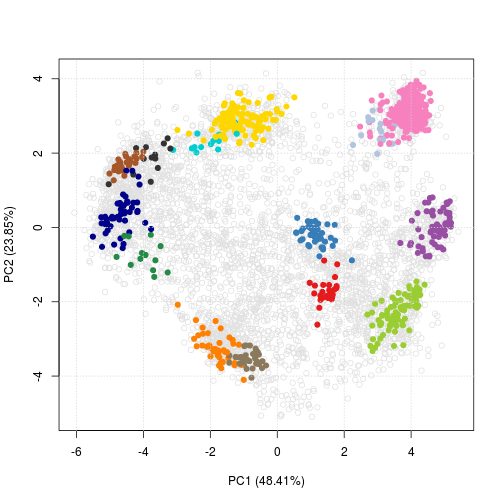

## The `pRolocdata` `hyperLOPIT` data, as csv files

This data originates from the Bioconductor
[`pRolocdata`](http://bioconductor.org/packages/release/data/experiment/html/pRolocdata.html)
package. It is a recent spatial proteomics dataset, formatted and
analysed using the
[`pRoloc`](http://bioconductor.org/packages/release/bioc/html/pRoloc.html)
software.

#### Installation

To install these software:

```r
source("https://bioconductor.org/biocLite.R")
biocLite("pRoloc")
biocLite("pRolocdata")
```

#### Accessing the data


```r
suppressPackageStartupMessages(library("pRolocdata"))
data(hyperLOPIT2015)
class(hyperLOPIT2015)
```

```
## [1] "MSnSet"
## attr(,"package")
## [1] "MSnbase"
```

```r
hyperLOPIT2015
```

```
## MSnSet (storageMode: lockedEnvironment)
## assayData: 5032 features, 20 samples 
##   element names: exprs 
## protocolData: none
## phenoData
##   sampleNames: X126.rep1 X127N.rep1 ... X131.rep2 (20 total)
##   varLabels: Replicate TMT.Reagent ... Iodixonal.Density (5 total)
##   varMetadata: labelDescription
## featureData
##   featureNames: Q9JHU4 Q9QXS1-3 ... Q9Z2R6 (5032 total)
##   fvarLabels: entry.name protein.description ... markers2015 (25
##     total)
##   fvarMetadata: labelDescription
## experimentData: use 'experimentData(object)'
## Annotation:  
## - - - Processing information - - -
## Loaded on Mon Aug 22 13:47:10 2016. 
## Normalised to sum of intensities. 
##  MSnbase version: 1.21.7
```

This `MSnSet` class is specific to quantitative proteomics data, but
that can be summerised by 2 or 3 tabular data structures (from an R
point of view, 1 [expression `matrix`](./exprs.csv) and 1 or 2
`data.frames` describing the [features](./fdata.csv) and
[samples](./pdata.csv)), which are accessible individually with


```r
exprs(hyperLOPIT2015)[1:6, 1:3] ## a matrix
```

```
##          X126.rep1 X127N.rep1 X127C.rep1
## Q9JHU4       0.028      0.034      0.024
## Q9QXS1-3     0.039      0.134      0.095
## Q9ERU9       0.021      0.013      0.014
## P26039       0.120      0.255      0.148
## Q8BTM8       0.055      0.139      0.078
## A2ARV4       0.000      0.085      0.223
```


```r
fData(hyperLOPIT2015)[1:6, 1:3] ## a data.frame
```

```
##           entry.name
## Q9JHU4   DYHC1_MOUSE
## Q9QXS1-3  PLEC_MOUSE
## Q9ERU9    RBP2_MOUSE
## P26039    TLN1_MOUSE
## Q8BTM8    FLNA_MOUSE
## A2ARV4    LRP2_MOUSE
##                                                                                                                         protein.description
## Q9JHU4                                              Cytoplasmic dynein 1 heavy chain 1 OS=Mus musculus GN=Dync1h1 PE=1 SV=2 - [DYHC1_MOUSE]
## Q9QXS1-3 Isoform PLEC-1 of Plectin OS=Mus musculus GN=Plec - [PLEC_MOUSE]|Isoform PLEC-1A of Plectin OS=Mus musculus GN=Plec - [PLEC_MOUSE]
## Q9ERU9                                                     E3 SUMO-protein ligase RanBP2 OS=Mus musculus GN=Ranbp2 PE=1 SV=2 - [RBP2_MOUSE]
## P26039                                                                             Talin-1 OS=Mus musculus GN=Tln1 PE=1 SV=2 - [TLN1_MOUSE]
## Q8BTM8                                                                           Filamin-A OS=Mus musculus GN=Flna PE=1 SV=5 - [FLNA_MOUSE]
## A2ARV4                                  Low-density lipoprotein receptor-related protein 2 OS=Mus musculus GN=Lrp2 PE=1 SV=1 - [LRP2_MOUSE]
##          peptides.rep1
## Q9JHU4             175
## Q9QXS1-3           123
## Q9ERU9             101
## P26039             101
## Q8BTM8              95
## A2ARV4              85
```


```r
pData(hyperLOPIT2015)[1:6, 1:3] ## second data.frame
```

```
##            Replicate TMT.Reagent Acquisiton.Method
## X126.rep1          1        X126               MS3
## X127N.rep1         1       X127N               MS3
## X127C.rep1         1       X127C               MS3
## X128N.rep1         1       X128N               MS3
## X128C.rep1         1       X128C               MS3
## X129N.rep1         1       X129N               MS3
```

#### Producing the csv files


```r
write.csv(exprs(hyperLOPIT2015), file = "exprs.csv")
write.csv(fData(hyperLOPIT2015), file = "fdata.csv")
write.csv(pData(hyperLOPIT2015), file = "pdata.csv")
```

#### Visualisation


```r
pRoloc::plot2D(hyperLOPIT2015)
```

```
## Warning: replacing previous import 'BiocGenerics::var' by 'stats::var' when
## loading 'MLInterfaces'
```

```
## Warning: replacing previous import 'stats::var' by 'BiocGenerics::var' when
## loading 'pRoloc'
```



#### Session information


```r
sessionInfo()
```

```
## R Under development (unstable) (2016-12-09 r71771)
## Platform: x86_64-pc-linux-gnu (64-bit)
## Running under: Ubuntu 14.04.5 LTS
## 
## locale:
##  [1] LC_CTYPE=en_GB.UTF-8       LC_NUMERIC=C              
##  [3] LC_TIME=en_GB.UTF-8        LC_COLLATE=en_GB.UTF-8    
##  [5] LC_MONETARY=en_GB.UTF-8    LC_MESSAGES=en_GB.UTF-8   
##  [7] LC_PAPER=en_GB.UTF-8       LC_NAME=C                 
##  [9] LC_ADDRESS=C               LC_TELEPHONE=C            
## [11] LC_MEASUREMENT=en_GB.UTF-8 LC_IDENTIFICATION=C       
## 
## attached base packages:
## [1] parallel  methods   stats     graphics  grDevices utils     datasets 
## [8] base     
## 
## other attached packages:
## [1] pRolocdata_1.13.0   MSnbase_2.1.3       ProtGenerics_1.7.0 
## [4] BiocParallel_1.9.2  mzR_2.9.0           Rcpp_0.12.8        
## [7] Biobase_2.35.0      BiocGenerics_0.21.1
## 
## loaded via a namespace (and not attached):
##   [1] minqa_1.2.4           colorspace_1.3-1      hwriter_1.3.2        
##   [4] class_7.3-14          modeltools_0.2-21     mclust_5.2           
##   [7] pls_2.5-0             base64enc_0.1-3       proxy_0.4-16         
##  [10] MLInterfaces_1.55.0   MatrixModels_0.4-1    affyio_1.45.0        
##  [13] flexmix_2.3-13        AnnotationDbi_1.37.0  mvtnorm_1.0-5        
##  [16] codetools_0.2-15      splines_3.4.0         doParallel_1.0.10    
##  [19] impute_1.49.0         robustbase_0.92-7     knitr_1.15.1         
##  [22] jsonlite_1.1          nloptr_1.0.4          caret_6.0-73         
##  [25] pbkrtest_0.4-6        annotate_1.53.0       rda_1.0.2-2          
##  [28] cluster_2.0.5         kernlab_0.9-25        vsn_3.43.4           
##  [31] sfsmisc_1.1-0         shiny_0.14.2          compiler_3.4.0       
##  [34] sampling_2.7          assertthat_0.1        Matrix_1.2-7.1       
##  [37] lazyeval_0.2.0        limma_3.31.6          htmltools_0.3.5      
##  [40] quantreg_5.29         tools_3.4.0           ggvis_0.4.3          
##  [43] gtable_0.2.0          affy_1.53.0           reshape2_1.4.2       
##  [46] dplyr_0.5.0           pRoloc_1.15.3         MALDIquant_1.15      
##  [49] trimcluster_0.1-2     gdata_2.17.0          preprocessCore_1.37.0
##  [52] nlme_3.1-128          iterators_1.0.8       fpc_2.1-10           
##  [55] stringr_1.1.0         lme4_1.1-12           lpSolve_5.6.13       
##  [58] mime_0.5              gtools_3.5.0          XML_3.98-1.5         
##  [61] dendextend_1.3.0      DEoptimR_1.0-8        zlibbioc_1.21.0      
##  [64] MASS_7.3-45           scales_0.4.1          BiocInstaller_1.25.2 
##  [67] pcaMethods_1.67.0     SparseM_1.74          RColorBrewer_1.1-2   
##  [70] memoise_1.0.0         ggplot2_2.2.0         biomaRt_2.31.3       
##  [73] rpart_4.1-10          stringi_1.1.2         RSQLite_1.1          
##  [76] highr_0.6             genefilter_1.57.0     S4Vectors_0.13.5     
##  [79] randomForest_4.6-12   foreach_1.4.3         e1071_1.6-7          
##  [82] prabclus_2.2-6        bitops_1.0-6          mzID_1.13.0          
##  [85] evaluate_0.10         lattice_0.20-34       htmlwidgets_0.8      
##  [88] gbm_2.1.1             plyr_1.8.4            magrittr_1.5         
##  [91] R6_2.2.0              IRanges_2.9.14        DBI_0.5-1            
##  [94] whisker_0.3-2         mgcv_1.8-16           survival_2.40-1      
##  [97] RCurl_1.95-4.8        nnet_7.3-12           tibble_1.2           
## [100] msdata_0.15.0        
##  [ reached getOption("max.print") -- omitted 12 entries ]
```
